Laboratório: Criando servidor DNS local

Neste Laboratório será realizado a criação de um servidor DNS local na VM Rocky Linux hospedada no Proxmox. A VM em questão tem a seguinte configuração de rede:

IP: 192.168.10.2
Gateway: 192.168.10.1
Máscara: 255.255.255.0
Broadcast: 192.168.10.255
Vlan: 10 

No Mikrotik existe uma bridge com a ether2 e ether3, pendurado nessa bridge existe a Vlan com a tag 10. A faixa de IP para os demais dispositivos conectados no Mikrotik é a 192.168.88.x.

 1. Instalando dnsmasq 

O serviço de DNS que será utilziado na VM Rocky Linux é o dnsmasq, ele é leve e simples de ser configurado e bastante útil para redes corporativas pequenas e homelabs como este.
Para iniciarmos e necessários fazer a instalação do serviço do sistema operacional. 

* sudo dnf install dnsmasq 

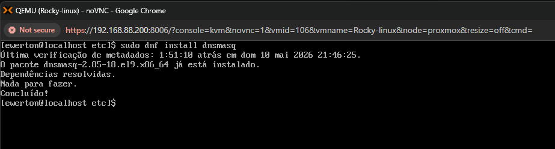 

A distro Rocky Linux, ela é baseada na Red Hat, que é um sistema operacional voltado para o ambiente corporativo, diante disso, ela não opera como sistemas baseados no Debian
que ao instalar um serviço ele entra em execução automaticamente. é necessários manualmente deixar o serviço habilitado para inciar no próximo boot e inciar o serviço na sessão atual.

* sudo systenctl status dnsmasq
* sudo systemctl enable dnsmasq

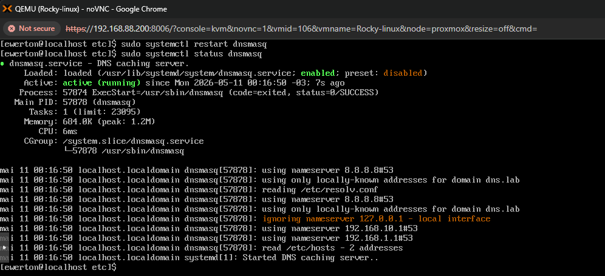 

* sudo systectl start dnsmasq
* sudo systenctl status dnsmasq

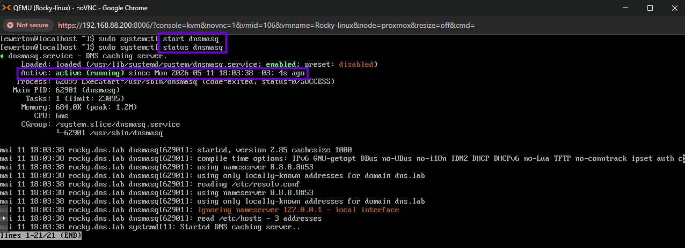 

 2. configuração dnsmasq 
 
 Após a instação do dnsmasq, é preciso fazer as configurações para que ele funcione corretamente. Suas configurações podem ser feitas em /etc/dnsmasq
 
* sudo nano /etc/dnsmasq.conf 
 
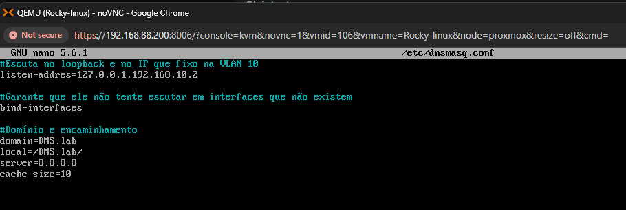 

Cada linha é uma instrução do que o serviço deve fazer.

listen-address=127.0.0.1,192.168.10.2: Diz ao serviço para "abrir os ouvidos" apenas nessas interfaces.

domain=DNS.lab: Define o sufixo padrão da rede.

local=/DNS.lab/: Diz ao dnsmasq que ele é a "autoridade máxima" para esse domínio. 
Se ele não achar um nome terminado em .DNS.lab no /etc/hosts, ele responde que não existe, em vez de tentar perguntar aos servidores do Google.

server=8.8.8.8: Define os Forwarders. Se alguém pedir "google.com", o Rocky não sabe quem é, então ele repassa a pergunta para o 8.8.8.8.

cache-size=1000: Guarda as últimas 1000 respostas na RAM. Se você pedir o Google de novo, a resposta vem em 1ms em vez de 20ms.

Depois de fazer as alterações nos arquivos de configuração, é necessário também reinciar o serviço com "sudo systemctl restart dnsmasq".
Porém ao executar esse comando o serviço falhou, olhando o status foi identificado o seguinte log:

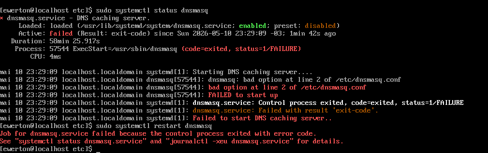 

Conforme o log do systemctl status, a linha 2 está com algum erro de syntaxe, e esse erro era a palavra address que estava só com um "S". Após essa correção ocorreu um outro erro
na linha 11, também de syntaxe. Utilziando o comando:

* jpurnalctl -xeu dnsmasq.service 

É possível visualizar melhor ambos os erros de syntaxe:

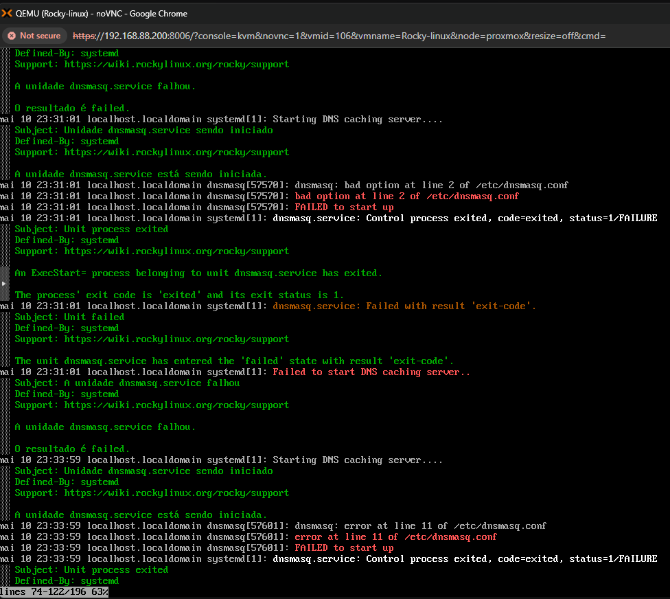 

Realizado a correção no arquivo de configuração.

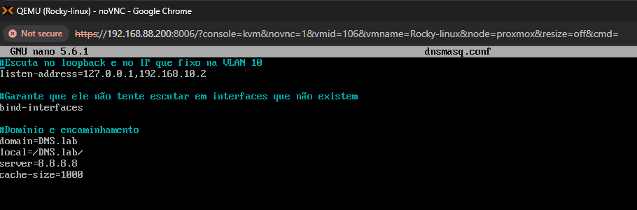 

Serviço passou a funcionar corretamente!

 3. NetworkManager 
 
O rocky Linux utiliza o NetworkManager como gerenciador de rede. O NetworkManager quando recebe DHCP do Mikrotik automaticamente configura IP, gateway, máscara e DNS.
Sistemas operacionais Linux possuem um arquivo na qual o sistema consulta para saber a onde localizar um servidor DNS. Como o NetworkManager gerencia isso, ele escreve nesse file.
Esse arquivo é o /etc/resolv.conf. 

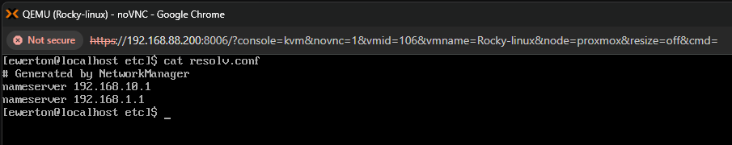 

Nessa caso, toda vez que o sistema inicar/reiniciar o NetworkManager vai ver que o DHCP (ou a config da interface) mandou usar o DNS do MikroTik e vai escrever/sobrescrever no arquivo.
Isso iria afetar no funcionamento do DNS local, pois o sistema consulta /etc/resolv.conf para saber em qual servidor solicitar a resolução do nome. Como o servidor é local, o IP em /etc/resolv.conf
precisa ser o de loopback (127.0.0.1). Mas se configurado esse IP no resolv.conf e o NetworkManager ou a VM reiniciar, ele irá sobrescrever a alteração. Diante disso e essencial é 
que a configuração da interface seja alterada. Para isso será usado uma ferramenta de linha de comando poderosa e prática para controlar o serviço NetworkManager, o nmcli:

* sudo nmcli connection modify ens18 ipv4.dns "127.0.0.1"
* sudo nmcli connection up ens18

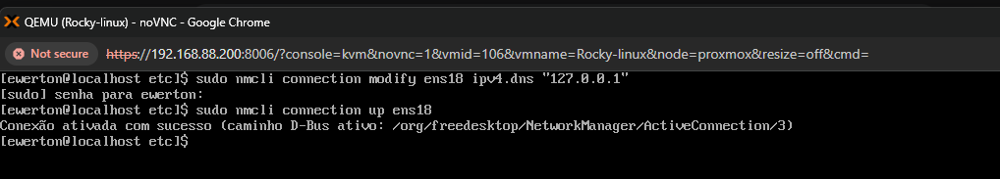 

Após a aplicação da configuração, usando o comando "cat" é possível observar que agora tem 3 endereços de servidor DNS, porém o intuito é que a consulta seja feita apenas no DNS local.
Foi acrescido endereço e mantido os endereços fornecido pelo DHCP, pois não foi especificado para o NetworkManager que ele deve ignorar DNS automático. Para isso, usa-se o comando:

* sudo nmcli connection modify NOME_DA_INTERFACE ipv4.ignore-auto-dns yes

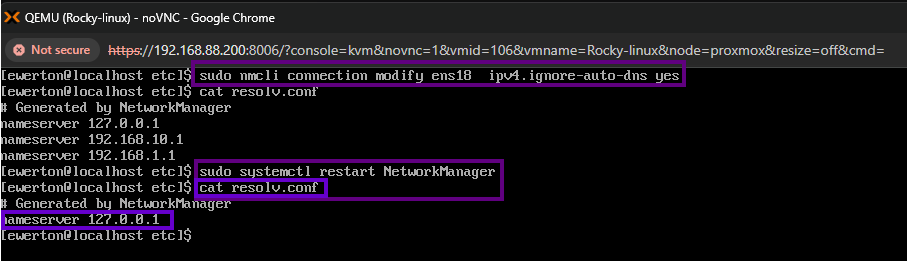 

Como o comando já tinha sido usado o comando "sudo nmcli connection modify ens18 ipv4.dns "127.0.0.1"", certamente o ip de loopback seria persistente. Utilizando o "cat" os IP automáticos
ainda estavam registrados no arquivos, porém ao rosar o "sudo systemctl restart NetworkManager" e executado o "cat /etc/resolv.conf de novo, apenas o IP de loopback se encontra registrado. 

Para uma visualização melhor o que a ferramente nmcli alterou de fato, é possível ir até os arquivos de configuração do NetworkManager.

* cd /etc/NetworkManager/system-connection
* cat ens18.nmconnection

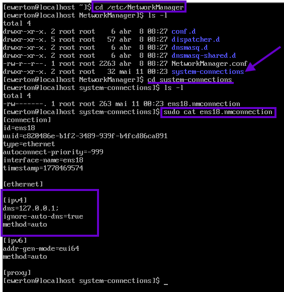 

ens18.nmconnection é a onde o nmcli altera o "manual" da interface. Usando o comando "cat" é possível visualizar a alteração do arquivo. a instrução é que ignore DNS automáticos e deixe 
configurado apenas o IP de loopback. 

 4. Domínio Local 
 
Os sistemas operacionais linux possuem um arquivo /etc/hosts que serve para mapear manualmente nomes de domínio (hostnames) para endereços IP, agindo como um sistema DNS local. 
O serviço dnsmasq tem uma vantagem que ele lê o arquivo /etc/hosts do servidor e transforma as entradas em registros DNS automaticamente. Para fins de teste, será mapeado manualmente
o próprio sistema Rocky Linux.

* sudo nano /etc/hosts

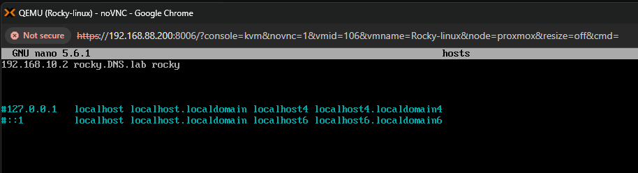 

Agora internamente, foi criado um domínio e esse domínio está associado a um IP. 

 5. Validação 
 
Com a configuração do dnsmasq concluída e a do NetworkManager também, é importante validar o funcionamento do DNS local. Para isso será realizado três testes:
1. Validar dentro do Rocky Linux:
--Teste de internet (Forwarding)
--Teste de nome interno 
2. Validando de fora (Pc e outras VM's)

Dentro do Rocky Linux usaremos a ferramenta "dig". Ela serve para realizar consultas a servidores DNS e exibir informações detalhadas sobre os registros de um domínio.

Teste de internet (Forwarding):

* dig google.com

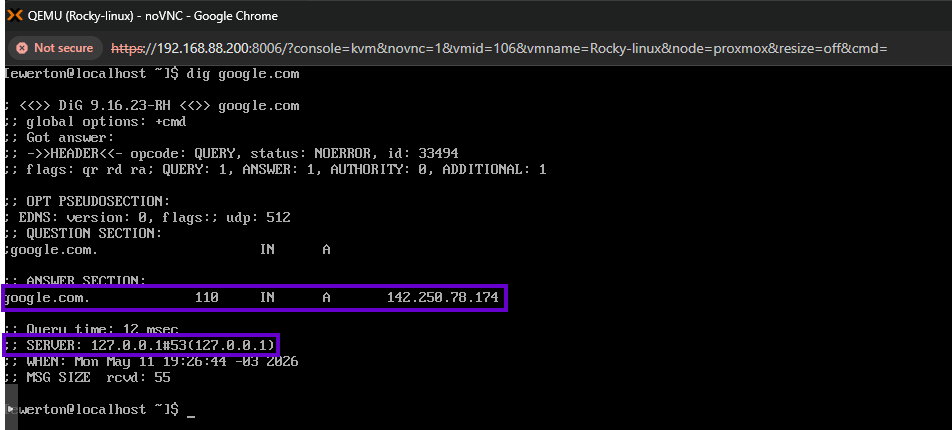 

Na imagem é possível visualizar que:

Got answer - Status: NOERROR - Sinalização de que o domínio foi localizado.
Answer section - google.com 142.250.78.174 - Associação do domínio escolhido ao IP questionado. 
Server - 127.0.0.1#53 - Servidor que respondeu a solicitação

Ou seja, o comando valida:

resolv.conf - Direcionando corretamente 
dnsmasq local - Escutando na porta de loopback configurada 
encaminhamento externo - dnsmasq faz o encaminhamento para o DNS 8.8.8.8
conectividade internet - Acesso a internet funcional. 

Teste de comunicação direta:

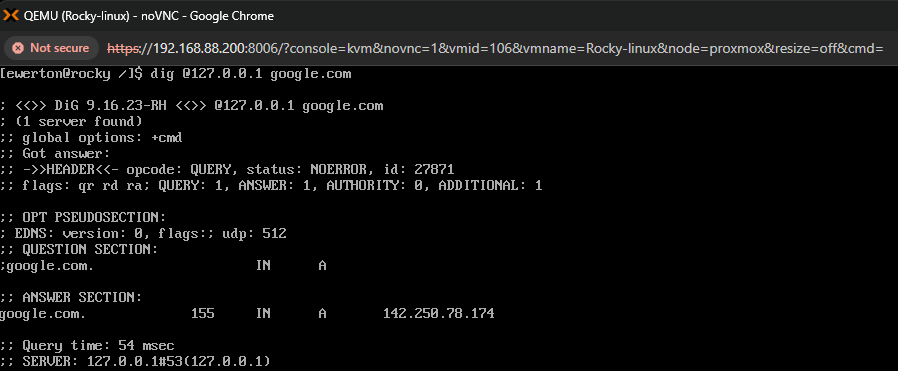

Agora incluindo o IP de loopback antes do domínio, o comando dig irá ignorar o /etc/resolv.conf, que contém o IP do servidor DNS e vai direcionar a requisição direto para o servidor DNS.

Esse teste valida:

dnsmasq escutando no loopback
porta 53 funcionando localmente

Teste de nome interno:

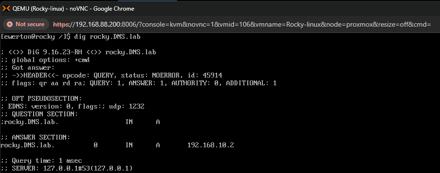

Isso valida:

domínio local
integração com /etc/hosts
resolução local sem internet

Validando de fora (Pc e outras VM's):

No windows, foi feito a tentativa de requisição DNS utilizando o cmd.

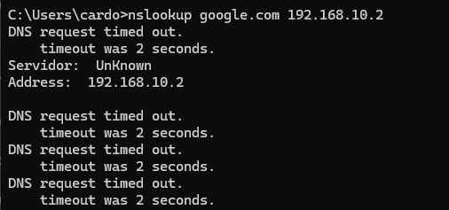

Identificado que o nslookup, ferramenta que segue a mesma linha de raciocínio que o dig, não conseguiu comunicação com com o serviço. 

Mesmo resultado testando no Ubuntu, VM que também está hospedada no proxmox, mas fora da Vlan10.

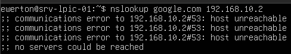

Falha na comunicação também. 

Diante desse cenário, a possível causa dessa falta de comunicação, visto que internamente o serviço está funcional, é o bloqueio que o firewall do Rocky Linux estava fazendo. Então, foi feita
a liberação do tráfego DNS no firewall:

* sudo firewall-cmd --add-service=dns --permanent

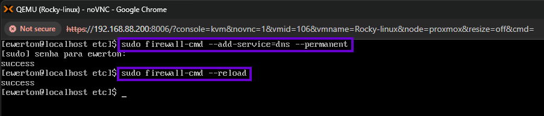

Após a liberação do tráfego DNS, testes no Windows e Linux tiveram repsostas corretamente.

Windows:

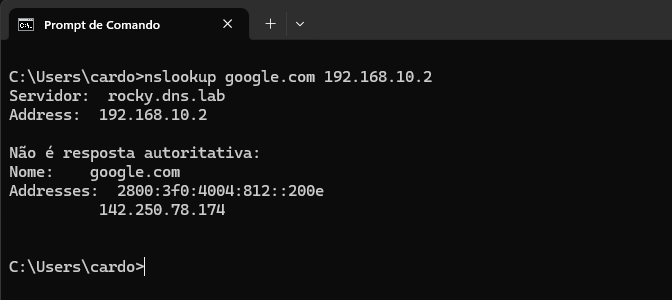

Linux:

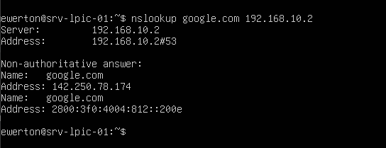

Sendo assim, serviço DNS fornecido pelo programa dnsmasq funcionando corretamente e o lab agora possui um DNS interno. 

 

 
 

