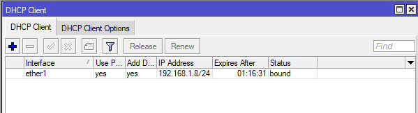
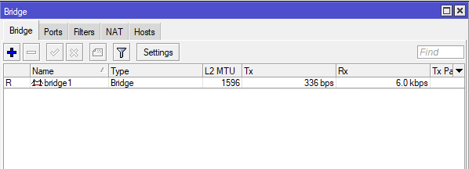
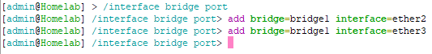
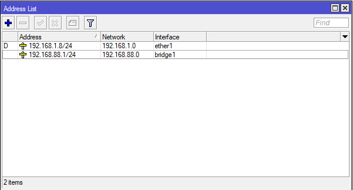
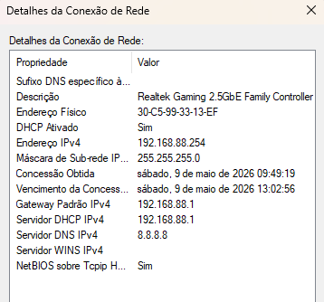
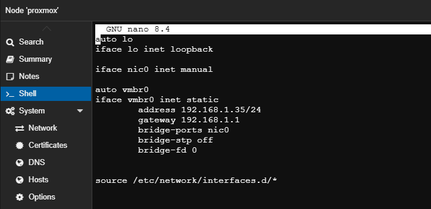
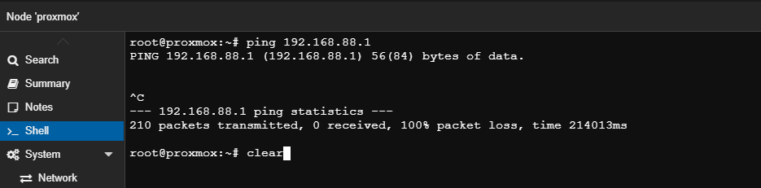
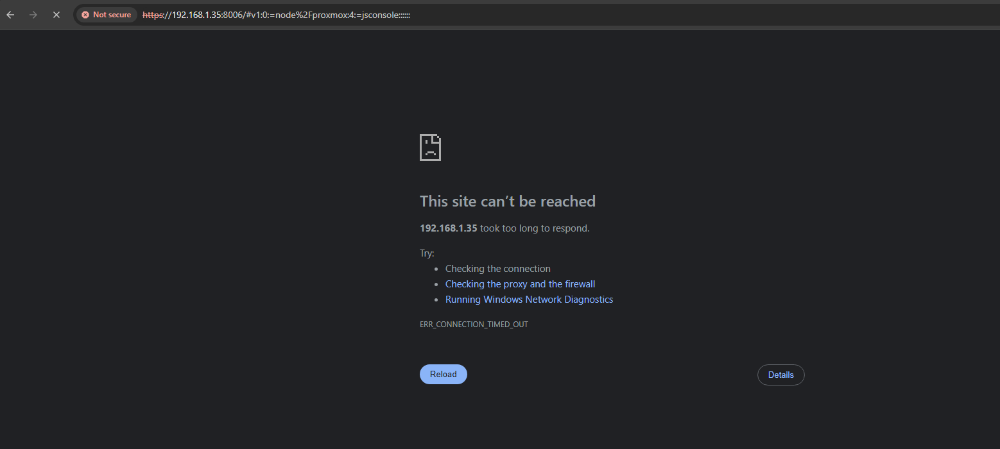
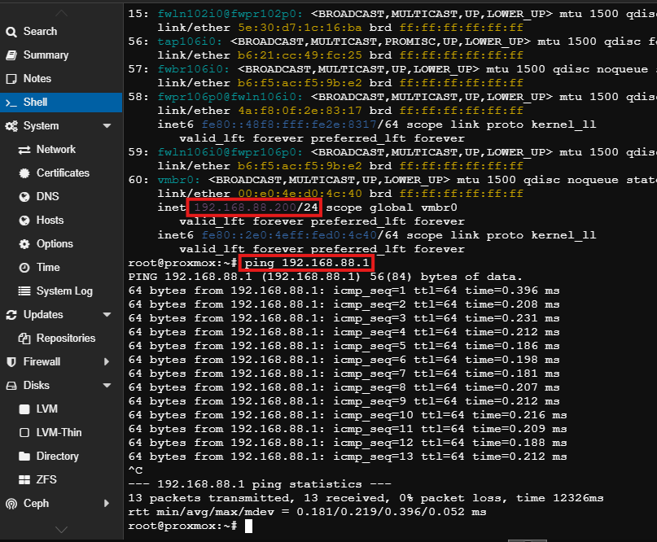

Laboratório: Migrando Proxmox da rede do roteador para a rede MikroTik

Neste laboratório será realizada a migração do servidor Proxmox, que anteriormente estava conectado diretamente na rede do roteador doméstico, para a rede do MikroTik.

Resumo geral da rede doméstica:

Rede: 192.168.1.0/24

Gateway: 192.168.1.1

Máscara: 255.255.255.0

Broadcast: 192.168.1.255

No MikroTik, a interface ether1 foi configurada como DHCP Client para receber automaticamente um endereço IP do modem/roteador doméstico.

Ao definir a ether1 como DHCP Client, o MikroTik passa a receber automaticamente as configurações necessárias para acesso à internet, como:

Endereço IP

Gateway padrão

DNS

Máscara de rede

Dessa forma, não é necessário realizar essas configurações manualmente.

O objetivo deste laboratório era migrar o servidor Proxmox para a rede do MikroTik. Entretanto, o computador utilizado para acessar a interface web do Proxmox também estava conectado na rede do modem doméstico. 
Assim, ambas as máquinas precisariam migrar para a nova rede criada no MikroTik.

Para isso, foi criada uma bridge entre as interfaces ether2 e ether3.

Após a criação da brigde, é preciso incluir as interfaces que farão parte dessa bridge.

Com a bridge criada e as interfaces físicas adicionadas, também é necessário atribuir um endereço IP para essa interface lógica.

 
Após a bridge ser criada, identificada com um endereço IP e configurada com as interfaces ether2 e ether3, basta conectar os dispositivos em suas respectivas portas.

O computador utilizado para acessar o Proxmox ficou na faixa:

- 192.168.88.254
 

 
O Proxmox, por sua vez, utilizava um endereço IP fixo por se tratar de um servidor. Inicialmente, ele ainda permanecia na mesma rede do modem doméstico.
 

 
Foi realizado um teste de comunicação entre o Proxmox e a rede do MikroTik.

 
 
Como os dispositivos estavam em redes diferentes, a comunicação falhou.

Nesse cenário, duas abordagens poderiam ser utilizadas:

1 - Alterar a rede do MikroTik para utilizar a mesma faixa de IP do Proxmox e, posteriormente, conectar o servidor ao equipamento.

2 - Alterar o endereço IP do Proxmox ainda conectado ao modem. Após a aplicação do novo IP, o servidor ficaria temporariamente inacessível ("cego") até ser conectado fisicamente à rede do MikroTik.

A segunda opção foi escolhida para observar o comportamento da rede durante a migração.

O endereço IP do Proxmox foi alterado para:

- 192.168.88.200

Após a aplicação da nova configuração de rede, a interface web do Proxmox ficou inacessível temporariamente, apresentando timeout no navegador.
 

 
Isso ocorreu porque o servidor passou a pertencer à rede 192.168.88.0/24, enquanto ainda estava fisicamente conectado na rede antiga.

Após conectar o Proxmox na interface ether3 do MikroTik, o servidor voltou a ficar acessível através do novo endereço IP: 
 

Com isso, a migração do Proxmox para a rede do MikroTik foi concluída com sucesso.
